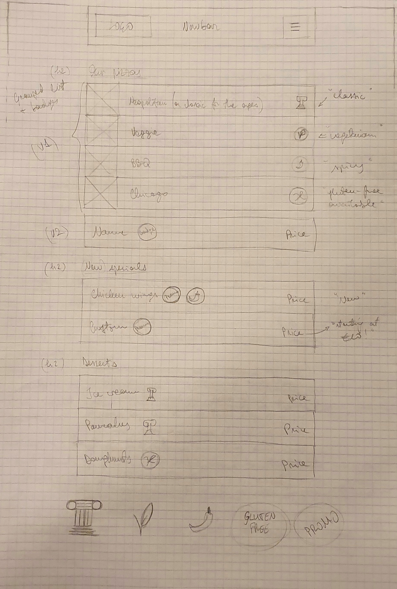
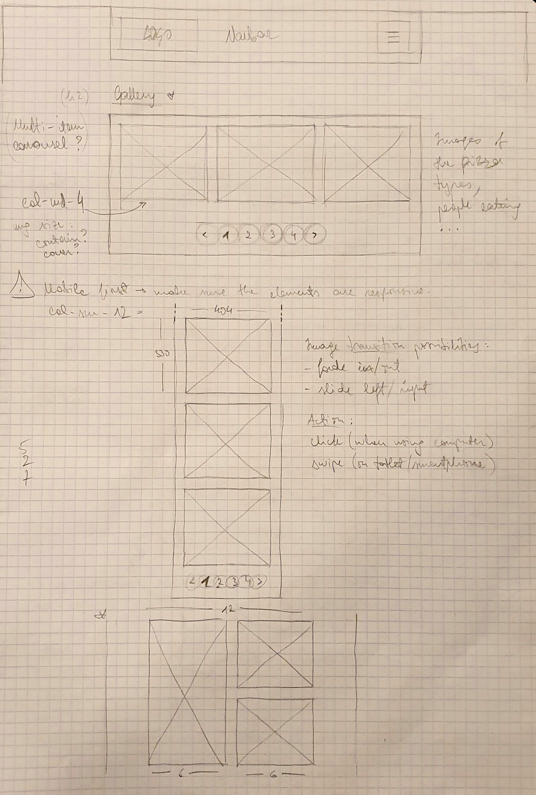

# Welcome to my restaurant!

## Link to assignment
https://github.com/becodeorg/BXL-Swartz-5.34/blob/main/1.The-Field/10.Bootstrap/restaurant.adoc

## Description
This website is responsive with five accessible pages :
1. Welcome
	- Jumbotron + 2 news panels (promo, events)
2. Menu
	- Menu = group list + badges
3. Pictures
	- Min 10 pictures gallery -> 3 photos/page
4. Restaurant
	- Multiple restaurant addresses + map + schedules
5. Contact
	- Contact form = firstname + lastname + email + subject (**dropdown list** of options) + message area + button (with icon)

## Languages used
- HTML
- CSS (attempt with SASS)
- Bootstrap

## Tools used
- Sublime text (text editor)
- Adobe XD (hi-fi prototyping)
- Personal notebook and pencil (brainstorming and low-fi prototyping)

---

## Process log

(06/10)
### Step 1 : research

#### Few basic questions:
- what kind of restaurant ? 
	- Franchise = restaurant that has branched out to many locations/investors, with a formula that allows for it to expand like so. Known nationally/internationally.
	- Multiple locations, however the food is consistent
	- Also, support system : community engagement, in-house loans, training programs... (are these necessary here?)

- What kind of food ?
	- Pizza (simple and beloved by all !).

- Inspiration : Domino's Pizza + top ten common/most popular pizza types.
- Selection :
	1. Neapolitan (a classic for the ages)
	2. Pepperoni (often the only meat that matters)
	3. Four cheeses (you can never have too much cheese)
	4. Chicago-style (deep-dished wholesome yummy goodness)
	5. Veggie (yes, even this is real / we're very considerate / don't worry, the mushrooms are actually good for you / trust me, this one's a veggie)
	6. Meat (for all the meat lovers out there that want more)
	7. Seafood (it's actually that good, trust me)
	8. BBQ (an upgraded meat pizza with a special sauce)
	9. Hawaiian (yes there are people who like this, and we are not ashamed)
	10. Supreme (the name speaks for itself)

- Other menu options
	- Spicy chicken wings (hotter than your SO)
	- Custom (just the way you would like it)
	- Desserts :
		- Ice cream (another classic)
		- Pancakes (hot and fluffy !)
		- Home made doughnuts (see above)

- Resources : see 'Resources' section.
- Name idea : Pizza Master
- Locations : Brussels, Ghent, Anvers, De Haan (another potential issue : I have no building to present, so how do I include a location photo ? Or do I even need to ? Maybe a map would suffice. Also learn how to include a map in CSS/Bootstrap.)

#### Issues to maybe watch out for :
- Make the site responsive, MOBILE FIRST, small + medium screens (on Bootstrap, sm and md for those respectively ; on CSS, media queries, careful with syntax).
- 5 accessible pages = 5 seperate HTML page (index/welcome, menu, gallery, restaurants/find us, contact) + 1 (master) CSS stylesheet
	- Use a href="#" to link them.
- Re-read instructions, keep it simple, don't go crazy.
- Learn how to include Google maps + Contact Form (though this doesn't necessarily have to be interactive, just take care of the visual layout)

#### Following steps to take : 
1. Finish research
2. Outline the structures of each page (see the inspiring links and see what those sites have in common)
	- Welcome
	- Menu
	- Gallery
	- Find us
	- Contact
3. Low fidelity prototype on paper (see pictures of sketches)
4. Higher fidelity prototype on Adobe XD
5. Coding on Sublime using HTML, CSS (and take a look at SASS, Bootstrap.

### Step 2 : outlining the structures of each page on paper

#### Welcome
'A page with one Jumbotron and **two panels** to show news (promo, events, etc).'

- Possible issue : to keep it simple, this page should probably just include the navigation + news, and not the other elements (contact, menu, and such), otherwise it will be too long and take too long to code...
- Another thing to consider (maybe later) : write in English and French?

- News panel on welcome page ideas : BBQ day promo + 'Create your own pizza Workshop' event.

Structure :
- Navbar in a Header = Logo + Home (combine Logo and Home? --> see Domino's) + Menu + Gallery + Restaurants + Contact (this should actually be on each page ; give a fixed position?).
- Hero section (using Jumbotron) for promos and events :
	- for promos/events, how to lay the out ? (slideshow, too complex for now; top and bottom, or side by side?)
	- Within Jumbotron, top/bottom approach seems interesting.
	- TWO panels : see low-fi prototype sketch + shared XD prototype (at a later time).

**Mobile first!!!!**

The navbar will cover the entire header space, the logo will remain + hamburger menu opposite it.

#### Menu

'A page with the restaurant menu in the form of a **grouped list with badges**.'

1. Grouped list for pizzas : 'Our Pizzas'
2. Grouped list for new or special items : 'Specials'
3. Grouped list for desserts : 'Desserts'

Badges = icons for 'Classics', 'Vegetarian', 'Spicy', 'Gluten-free available', and 'Promo'

Given that it's a series of group lists that occupy the width of the section, the mobile version shouldn't be much problem.

#### Gallery

'A page with a gallery of minimum 10 pictures and a **pagination** (3 photos per page).'

Give that it's 3 photos per page, having 12 pictures total would be nice in order to create 4 paginations. These pictures could be images of the different pizza types, people eating and enjoying themselves.

How would I present this ? It seems that a multi-item carousel would be an interesting display option, though it might get complicated (in the end, not necessary for this project).

Also, when it comes to Mobile first, the 3 images should be stacked on top of each other, maintaining the integrity of the pagination (which would still have to be reduced in size to fit the smaller screens, perhaps). These images could move at the same time when moving on to the next part ; on XD I could try a prototype with 2 types of transitions : fade in/out or slide left/right, and the actions to accomplish them would be click (on a computer) or swipe (on tablet/smartphone).

#### Restaurant (Find us)
'A page about the restaurants (it’s a franchise) with its addresses, **a map**, and different schedules.'

At first, I thought this would be an 'About' page, then I thought I simply had to create a (responsive) grid with the addresses and schedule info for each town I selected (Brussels, Ghent, Antwerp, De Haan). Though now I believe I ought to include a short paragraph describing the restaurant (like a mission statement).

Also for Mobile first, transition from one column to two (for desktop).

#### Contact
'A page with a contact form containing the firstname, lastname, email, subject of the message (a **drop-down list** with multiple options), an area for the message itself and a **send button with an icon**. Each entry as a title in a **semantically correct** tag.'

Another fairly simple page that will not include a lot of elements. However, it's an opportunity to learn how to do contact Forms (at least the visual aspect) and see more of what Bootstrap can help with, along with the previous pages.

All the information gathered on the features, tools and methods were collected from the links found under 'Resources'.

### Step 3 : sketching + a bit of low-fi prototyping
First, sketching low-fi prototypes of each page that will later be adapted and refined in hi-fi on Adobe XD (see sketches).

Welcome/homepage :

Menu :

Pictures :

Locations :

Contact :

---

(07/10)

### Step 4 : hi-fi prototying on XD

Firstly, design choices on the color palette based on the common colors used in other pizza websites 
- red, 
- black, 
- blue, 
- white, 

then selection of 2 font styles that would complement each other 
- Lobster 2, curvy and fun for the titles and headings
- Cabin, simple and sans for clear and easy-to-read paragraphs

Then, getting to work on XD, preparing the design work for desktop (min 1080px), tablet (992px) and smartphone screens (Samsung Galaxy S10 size).

Issue with the mobile menu page : to long to go through the entire list (it's no longer a thin smooth list, but rather a series of blocs).

(See XD file included in this repository)

### Step 5 : coding the pages with HTML, CSS (Sass) and Bootstrap

All the elements are outlined in the XD document. Starting with the welcome page, I'll lay out the code for them, for starters taking care of the overall structure and layout of each page, and worrying about the details (alignments, spacing and other small adjustments) a bit later. For now, I have a pretty good graps of how I can incorporate Bootstrap components and utilities to create the frontend of this website. For any aspects that I may not understand or have grasped or are simply giving me a hard time, I will ask my colleagues for help.

#### The search for the right (royalty-free) pictures
Good source ? https://www.pexels.com/

(See Image Credits)

#### Creating badges for menu lists
Badges for 'Classic' pizzas, 'Favorites', 'Vegetarian', 'Spicy' and items available as 'Gluten-free', creating using Adobe XD.

***Index/Welcome page is complete !!!***

---

(08/10)

***Menu page is complete !!!***
Lots of small adjustments and going back and forth through old exercises in order to find the right utilities, but well worth doing the overtime at home.

Gallery page problems : NO CAROUSEL (not the same thing) and create 4 gallery pages for the pictures. Bootstrap 4 and up have their own queries for animations and image transitions. So, we have to construct additional pages and link them. Still doable!

***Restaurants page complete !!!***
Tip for the future : when embedding code from Google Maps (one that I have created), make sur to include a **div id="map"** in its own dedicated row so that it's responsive.

When getting down to writing the code, I've often had to rethink certain design elements and adjust according to what info I manage to find, as well as my current skill level.
Also, I have to keep reminding myself not to get too caught up in detail (mostly for design elements) and to focus on the overall structure + the actual assignment of incorporating Bootstrap.

***Contact page complete (though minor adjustements still have to be made...)***

***Gallery page(s) complete!!!***

### Step 6 (added) : refining elements, alignments, design.

For future reference : when making a website with multiple pages, I think ideally the number of pages should be determined beforehand in order to make the same code structure and copy in the other HTML files. Also, one stylesheet is indeed enough to include styles for all elements on all pages (classes and IDs can certainly help in this).

--- 

(09/10)

A few more adjustments to the images in Galleries 1 and 4 in order to have a nice layout of different-sized images, as well as the pagination for all pages.
Then, the revelation that there can only be one  Bootstrap Javascript option, either bundled with Popper or without ; the bundle seems to be the best choice, and now the mobile menu works properly (before it didn't because I didn't select one of the options) and so does the dropdown list (it also helped that I referred to documentation and templates from Bootstrap 5 instead of 4 !!!), thus completing the small details for this website project.

Later today, I should probably add a footer on all pages (for, of course, copyright reasons, and for including social media pages that don't exist...).

***Footer added***

First I looked up what is typically included in a footer element and I retained a small menu with additional pages for more information on the franchise, a few social media pages to follow (Facebook, Twitter and LinkedIn icons were added) and a copyright, as well as a little element to get back to the top of the current page. As for the design, I still wanted to keep things simple and clear so I retained the same style for the header and used a Bootstrap grid to put the elements in place, again keeping Mobile first.

---

(11/10)

Some research into SASS and and how it's written in a text editor. The first stylesheet I created was inteded to be written with SASS, but it turns out I didn't write it correctly, though somehow it appeared in my browser as I was creating the site. However, there was no style applied when I pushed everything from my local folder onto Github, and then launched via Github Pages. I assumed that this was due to the incorrect syntax, so I copied yesterday the stylesheet and made it into a regular CSS file and linked my HTML files to that. Sure enough, when the Pages were finally deployed (and active), it worked!
Now I'm looking into SASS syntax to get a better grasp of how to write it and what it's intended for (as a more powerful version of CSS, from what I currently understand). This is more of a last research run into something I could better apply in future projects.

In addition, "tested" the launched website, modifying its dimensions, checking the mobile versions, making last-minute changes (including a "proper 'About' text").

***Final deployment ready.***

---

## Resources

### Franchise documentation
https://bizfluent.com/about-5541243-definition-franchise-restaurant.html
https://www.franchiserankings.com/reviews-and-ratings-of-best-restaurant-franchises

### Inspiration

#### Franchise examples

- Domino's Pizza
https://www.dominos.com/index.intl.html
https://www.dominos.be/fr
https://marketrealist.com/2015/03/dominos-pizza-master-franchise-model/

- Other
https://eastcoastwings.com/
https://www.mister-pizza.com/

#### Popular pizza types
https://www.webstaurantstore.com/article/101/types-of-pizza.html
https://thelistwire.usatoday.com/lists/the-10-most-popular-pizza-toppings/
https://www.ezcater.com/lunchrush/office/most-popular-types-of-pizza-around-country/?__cf_chl_jschl_tk__=pmd_ekd24y8QFyWi7AwXl3CTfdETvcJpt1dY.I_VprrK620-1633507670-0-gqNtZGzNAmWjcnBszQhR
https://www.thetoptens.com/types-pizzas/
https://www.dogtownpizza.com/blog/the-absolute-best-pizza-topping-combos/
https://www.dogtownpizza.com/blog/the-indisputable-top-ten-classic-pizza-varieties/

### More on Bootstrap

#### Documentation
- For welcome page
https://getbootstrap.com/docs/4.0/layout/grid/
[^1] https://getbootstrap.com/docs/4.0/components/jumbotron/
https://getbootstrap.com/docs/5.0/examples/jumbotron/

- For menu page
https://bootstrapshuffle.com/classes/list-group/list-group+with+badges
https://www.tutlane.com/example/bootstrap/bootstrap-list-group-with-badges-example
https://www.w3schools.com/bootstrap/bootstrap_list_groups.asp

- For gallery page
https://www.w3schools.com/bootstrap/bootstrap_images.asp
https://mdbootstrap.com/docs/standard/extended/gallery/ (see 'Multi-item carousel')
http://visuallightbox.com/content/27-stunning-html-bootstrap-image-slideshow-and-gallery-examples-1870.html
https://colorlib.com/wp/bootstrap-pagination/ (see 'Bootstrap Buttons V18')
https://www.vuescript.com/bootstrap-inspired-pagination-plugin-vue-js/
https://bootstrapcreative.com/pattern/responsive-image-gallery/
https://www.youtube.com/watch?v=F0FkpgNtyt0
https://getbootstrap.com/docs/4.0/components/pagination/

- For Find us page
https://mamaspizzas.net/location
https://mdbootstrap.com/docs/b4/jquery/javascript/google-maps/
https://bootstrapious.com/p/google-maps-and-bootstrap-tutorial
https://bootstrapstudio.io/docs/google-maps.html
https://www.youtube.com/watch?v=3posLKQrhfU

- For contact page
https://mdbootstrap.com/docs/b4/jquery/forms/contact/
https://colorlib.com/wp/bootstrap-contact-form/
https://azmind.com/bootstrap-contact-form-dropdown-select/
https://getbootstrap.com/docs/4.0/components/dropdowns/
https://www.w3schools.com/bootstrap/bootstrap_dropdowns.asp
https://getbootstrap.com/docs/5.1/components/dropdowns/

- For footer
https://getbootstrap.com/docs/5.1/examples/footers/
https://www.w3schools.com/tags/tag_footer.asp

#### Tutorials
https://www.youtube.com/watch?v=Wqu-d_b3K-0&t=613s
https://www.youtube.com/watch?v=eow125xV5-c
https://www.youtube.com/watch?v=1nxSE0R27Gg
https://www.youtube.com/watch?v=itJcNZPYKZU

### Additional CSS references
[^2] https://developer.mozilla.org/en-US/docs/Web/CSS/Layout_cookbook/List_group_with_badges
Building with SCSS/SASS :
- https://www.codesmite.com/article/building-sass-and-scss-in-sublime-text
- https://www.toptal.com/front-end/sass-style-guide-a-sass-tutorial-on-how-to-write-better-css-code
- https://sass-lang.com/guide
- https://www.w3schools.com/sass/default.php
- https://sass-lang.com/documentation/syntax/structure
- https://www.koderhq.com/tutorial/sass/syntax/

### Design elements

- Color palettes
https://coolors.co/fb3640-605f5e-1d3461

- Font combinations
https://blog.snappa.com/font-combinations/
https://www.sliderrevolution.com/design/font-combinations/ (Lobster and Cabin)

### Image credits 
(Royalty-free)
1. Photo by Anna Shvets from Pexels, 'Person Preparing A Pizza', https://www.pexels.com/photo/person-preparing-a-pizza-5953528/
2. Photo by Kampus Production from Pexels, 'A Young Chef Making Pizza', https://www.pexels.com/photo/a-young-chef-making-pizza-8511856/
3. Photo by Pixabay from Pexels, 'Close-up of Pizza', https://www.pexels.com/photo/baking-cheese-cooking-crust-315755/ (for Neapolitan)
4. Photo by Polina Tankilevitch from Pexels, 'Cheesy Pepperoni Pizza In Close-up View', https://www.pexels.com/photo/cheesy-pepperoni-pizza-in-close-up-view-4109076/ 
5. Photo by Katerina Holmes from Pexels, 'Crop person with grater rubbing cheese on pizza', https://www.pexels.com/photo/crop-person-with-grater-rubbing-cheese-on-pizza-5908230/
6. Photo by Arthur Brognoli from Pexels, 'Close-Up Photo of Pizza', https://www.pexels.com/photo/close-up-photo-of-pizza-3343626/
7. Photo by Katerina Holmes from Pexels, ' Crop friends taking slices of delicious pizza from cutting board ', https://www.pexels.com/photo/crop-friends-taking-slices-of-delicious-pizza-from-cutting-board-5908255/
8. Photo by Christopher Farrugia from Pexels, 'Pizza Neon Light Signage Beside Wall', https://www.pexels.com/photo/pizza-neon-light-signage-beside-wall-3581878/
9. Photo by Airam Dato-on from Pexels, 'Person Holding Pizza on Brown Wooden Table', https://www.pexels.com/photo/person-holding-pizza-on-brown-wooden-table-9424930/
10. Photo by ROMAN ODINTSOV from Pexels, 'Pizza on White Ceramic Plate', https://www.pexels.com/photo/pizza-on-white-ceramic-plate-5903101/
11. Photo by Brett Jordan from Pexels, 'Pizza on Brown Wooden Board', https://www.pexels.com/photo/pizza-on-brown-wooden-board-825661/
12. Photo by Matheus Gomes from Pexels, 'Photo of Baked Pizza on Round White Plate', https://www.pexels.com/photo/photo-of-baked-pizza-on-round-white-plate-2608049/
13. Photo by Pixabay from Pexels, 'Close-up Photo of Fried Chicken', https://www.pexels.com/photo/close-up-photo-of-fried-chicken-60616/
14. Photo by Ivan Babydov from Pexels, 'Food in a Takeaway Box', https://www.pexels.com/photo/food-in-a-takeaway-box-7788315/

15. Twitter logo, https://www.clipartmax.com/middle/m2i8K9K9N4b1G6H7_twitter-circle-logo-svg/
16. Facebook logo, https://vtpkb4cbz742mpwjg43ich01-wpengine.netdna-ssl.com/wp-content/uploads/2020/03/Facebook-Logo.png
17. LinkedIn logo, https://www.clipartmax.com/middle/m2i8H7m2b1d3i8m2_linkedin-help-linkedin-logo-2018-png/